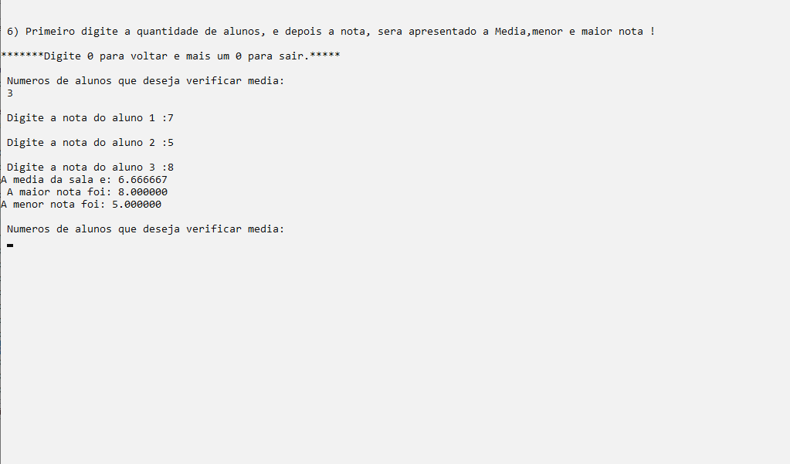
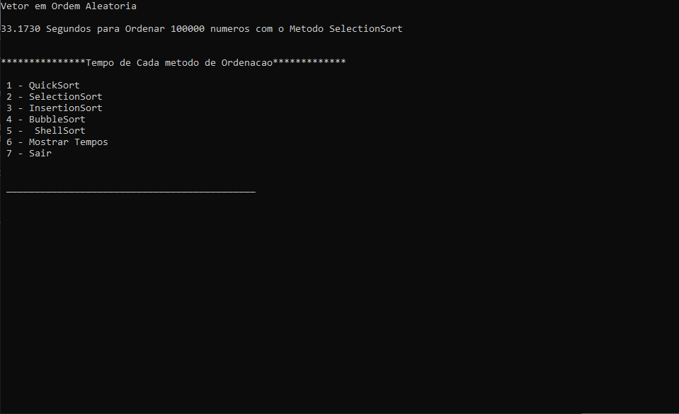

# Data structure in C

Compiled of exercises in c.

- Compiled of exercises


- Ordering methods


## Installation


```bash
Start CodeBlocks or similar
```

## License
- You can use the code for study.
- You may not use it for commercial purposes, subject to penalties under local law.
